# Simple Data Exploration

Todays topics:

- Explore Data
- Basic Data Visualization

## Working with Data

Data Science consists of several parts dealing with the data itself


In most programming languages there are special packages to realize data
science which are expanding the base packages. In `R` this specific
package is called `tidyverse` and consists of several parts which are
seamless work together. The base packages can realize similar results.
The parts of `tidyverse` are the defacto standard for these workloads.

To install the packages, run `install.packages("tidyverse")`. This is
needed just once. Now you can use all parts with the `library` command.
We need it among with the iris dataset which was introduced in the first
lesson.

``` r
library(tidyverse)
```

    ## ── Attaching packages ─────────────────────────────────────── tidyverse 1.3.2 ──
    ## ✔ ggplot2 3.3.6      ✔ purrr   0.3.4 
    ## ✔ tibble  3.1.8      ✔ dplyr   1.0.10
    ## ✔ tidyr   1.2.1      ✔ stringr 1.4.1 
    ## ✔ readr   2.1.3      ✔ forcats 0.5.2 
    ## ── Conflicts ────────────────────────────────────────── tidyverse_conflicts() ──
    ## ✖ dplyr::filter() masks stats::filter()
    ## ✖ dplyr::lag()    masks stats::lag()

``` r
library(datasets)
```

Now we are able to explore the dataset a bit more detailed. First we
want to convert the `data.frame` into a `tibble` which is the standard
datatype for tables in `tidyverse`. `tibbles` are data frames but they
tweak some old behaviours that make our life easier when analysing data.

To start with, printing the content of a tibble shows a rich output that
gives information about the data type of each column. By contrast, data
frames just show the records as is:

``` r
data("iris") # loading the dataset
class(iris)
```

    ## [1] "data.frame"

``` r
head(iris, n = 3) # head gives a first glance into datasets
```

    ##   Sepal.Length Sepal.Width Petal.Length Petal.Width Species
    ## 1          5.1         3.5          1.4         0.2  setosa
    ## 2          4.9         3.0          1.4         0.2  setosa
    ## 3          4.7         3.2          1.3         0.2  setosa

``` r
iris <- as_tibble(iris) # conversion to a tibble
class(iris)
```

    ## [1] "tbl_df"     "tbl"        "data.frame"

``` r
head(iris, n = 3)
```

    ## # A tibble: 3 × 5
    ##   Sepal.Length Sepal.Width Petal.Length Petal.Width Species
    ##          <dbl>       <dbl>        <dbl>       <dbl> <fct>  
    ## 1          5.1         3.5          1.4         0.2 setosa 
    ## 2          4.9         3            1.4         0.2 setosa 
    ## 3          4.7         3.2          1.3         0.2 setosa

The iris dataset is a very clean dataset. Data wrangling is not needed
and so we can concentrate on plotting today.

Plotting with `base R` is generally possible but cumbersome and the
results are not looking very modern and nice.

## ggplot

`ggplot` is the plotting package of `tidyverse` and works different and
is based on layering. This means we create a canvas which can be
constantly enhanced step by step until the result is what we want. Such
an approach is called “Grammar of Graphics” and is modular.

The parts of ggplot we work with today are:

- **Aesthetic mapping** from variables to visual characteristics
- **Geometric shapes** (points, lines, boxes, bars, histograms, maps,
  etc)
- **Labels** and **annotations**

Further there are

- **Scales** and **statistical transformations** (log, reverse, count,
  etc)
- **coordinate systems**
- **facets** ( multiple plots)

### scatter plots

#### base R

``` r
# base R plotting
plot(
    x = iris$Petal.Length, y = iris$Petal.Width
)
```

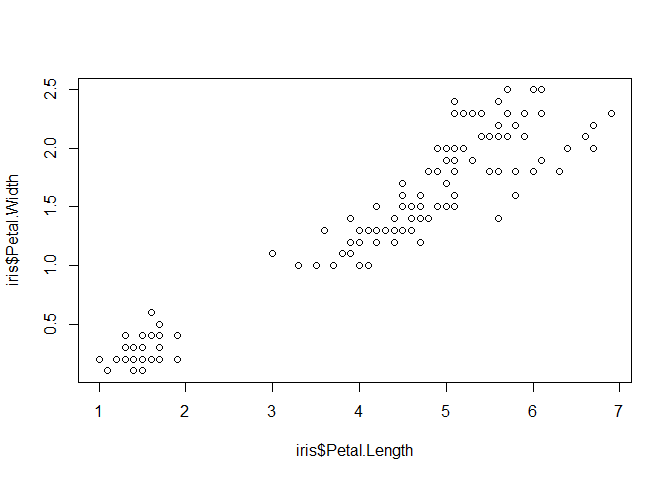<!-- -->

#### ggplot

``` r
# define a canvas with data
ggplot(data = iris)
```

<!-- -->

``` r
# map data to x and y coordinates
ggplot(data = iris) +
    aes(x = Petal.Length, y = Petal.Width)
```

<!-- -->

These “Aesthetic” mappings can be put directly into the commands:

``` r
# add data points
ggplot(data = iris, aes(x = Petal.Length, y = Petal.Width)) +
    geom_point()
```

<!-- -->

``` r
# change color & symbol type
ggplot(data = iris, aes(x = Petal.Length, y = Petal.Width)) +
    geom_point(aes(color = Species, shape = Species))
```

<!-- -->

The data seems to follow a linear model when all species are considered.
We want to ignore the proper tests this time and just get the R-value:

``` r
model <- lm(Petal.Width ~ Petal.Length, data = iris)
summary(model)
```

    ## 
    ## Call:
    ## lm(formula = Petal.Width ~ Petal.Length, data = iris)
    ## 
    ## Residuals:
    ##      Min       1Q   Median       3Q      Max 
    ## -0.56515 -0.12358 -0.01898  0.13288  0.64272 
    ## 
    ## Coefficients:
    ##               Estimate Std. Error t value Pr(>|t|)    
    ## (Intercept)  -0.363076   0.039762  -9.131  4.7e-16 ***
    ## Petal.Length  0.415755   0.009582  43.387  < 2e-16 ***
    ## ---
    ## Signif. codes:  0 '***' 0.001 '**' 0.01 '*' 0.05 '.' 0.1 ' ' 1
    ## 
    ## Residual standard error: 0.2065 on 148 degrees of freedom
    ## Multiple R-squared:  0.9271, Adjusted R-squared:  0.9266 
    ## F-statistic:  1882 on 1 and 148 DF,  p-value: < 2.2e-16

``` r
# add trend line
ggplot(data = iris, aes(x = Petal.Length, y = Petal.Width)) +
    geom_point(aes(color = Species, shape = Species)) +
    geom_smooth(method = lm)
```

    ## `geom_smooth()` using formula 'y ~ x'

<!-- -->

``` r
# add annotation text to a specified location by setting coordinates x = , y =
ggplot(data = iris, aes(x = Petal.Length, y = Petal.Width)) +
    geom_point(aes(color = Species, shape = Species)) +
    geom_smooth(method = lm) +
    annotate("text", x = 5, y = 0.5, label = "R=0.96")
```

    ## `geom_smooth()` using formula 'y ~ x'

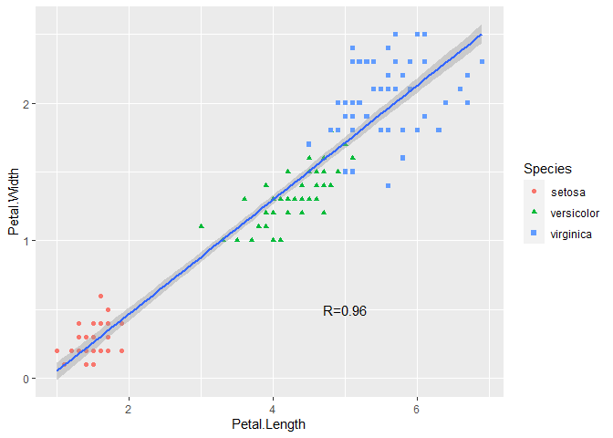<!-- -->

#### Exercise

Create a scatter plot of sepal length vs sepal width, change colors and
shapes with species, and add trend line. Print the R value into the plot
at a proper position. Add custom labels with `xlab` and `ylab` and also
add a title with `ggtitle`.

### Boxplots and violins


#### base R

``` r
boxplot(Sepal.Length ~ Species,
    data = iris
)
```

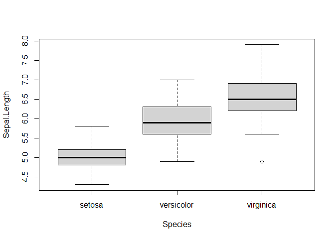<!-- -->

#### ggplot

``` r
# basic boxplot
ggplot(data = iris, aes(x = Species, y = Sepal.Length, color = Species)) +
    geom_boxplot()
```

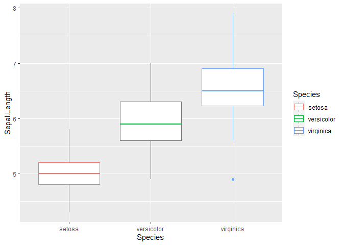<!-- -->

``` r
# add notch and specify color
ggplot(data = iris, aes(x = Species, y = Sepal.Length, color = Species)) +
    geom_boxplot(notch = TRUE, color = "black", aes(fill = Species))
```

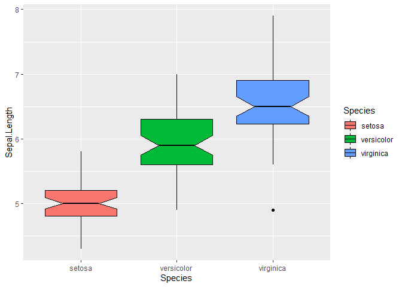<!-- -->

``` r
# add a small amount of points to the plot
ggplot(data = iris, aes(x = Species, y = Sepal.Length, color = Species)) +
    geom_boxplot(notch = TRUE) +
    geom_jitter()
```

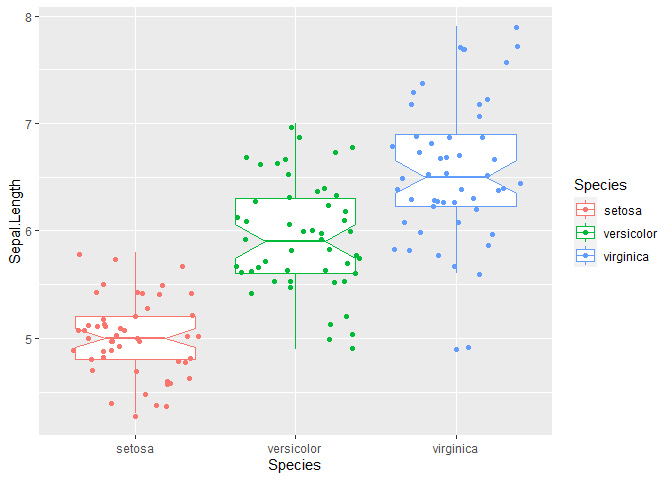<!-- -->

``` r
# reduce the noise of jittered points
ggplot(data = iris, aes(x = Species, y = Sepal.Length, color = Species)) +
    geom_boxplot(notch = TRUE) +
    geom_jitter(position = position_jitter(0.2))
```

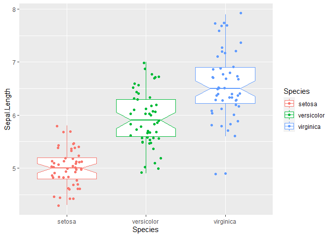<!-- -->

``` r
# use violin diagram
ggplot(data = iris, aes(x = Species, y = Sepal.Length, color = Species)) +
    geom_violin()
```

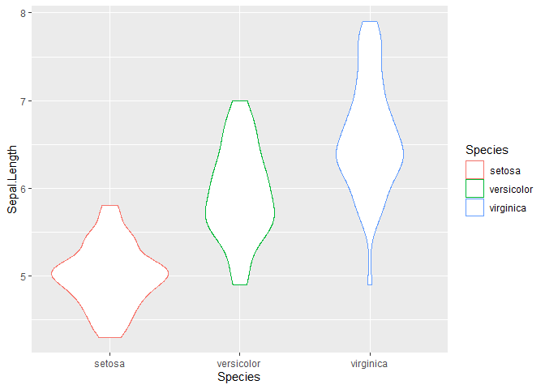<!-- -->

``` r
# add a small wrapped boxplot
ggplot(data = iris, aes(x = Species, y = Sepal.Length, color = Species)) +
    geom_violin() +
    geom_boxplot(width = 0.2)
```

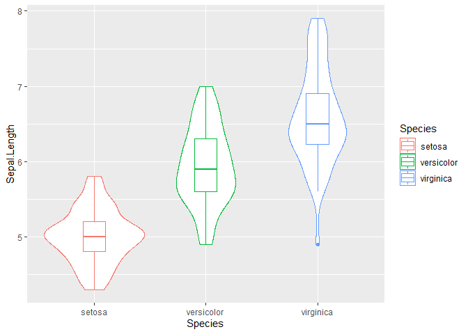<!-- -->

``` r
# switch to filled plots globally
ggplot(data = iris, aes(x = Species, y = Sepal.Length, fill = Species)) +
    geom_violin() +
    geom_boxplot(width = 0.2)
```

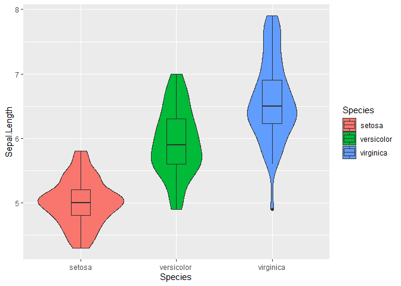<!-- -->

#### Exercise

Plot boxplots of the Petal length with surrounding violins. The boxplots
should be notched and filled with color. The violins are not filled and
have no species specific coloring.

### Histograms, frequency and density plots

#### base R

``` r
hist(iris$Sepal.Width, breaks = 12)
```

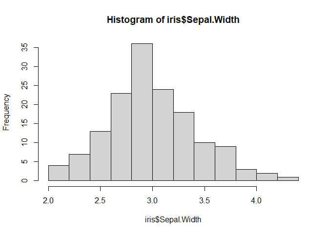<!-- -->

#### ggplot

It is actually better to use bin width instead of amount of bins to have
better visualization

``` r
# simple histogram
ggplot(data = iris, aes(x = Sepal.Width)) +
    geom_histogram(binwidth = 0.2)
```

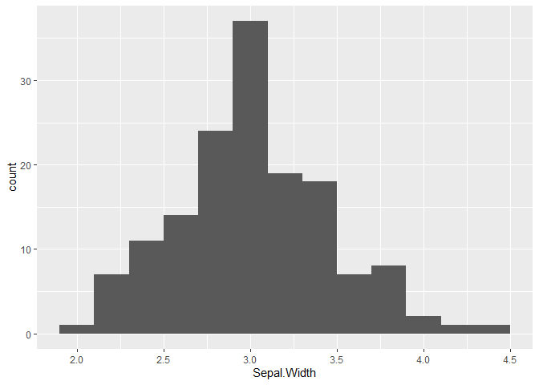<!-- -->

``` r
# add more information about the underlying data with stacking
ggplot(data = iris, aes(x = Sepal.Width)) +
    geom_histogram(
        binwidth = 0.2, color = "black", aes(fill = Species),
        position = "stack" # "stack" is the default
    )
```

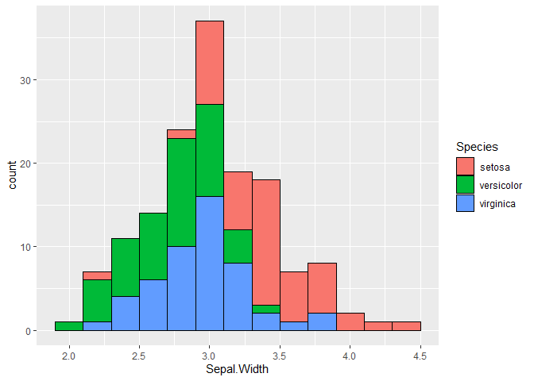<!-- -->

``` r
# Another option is to use overlayed histograms with an alpha value
ggplot(data = iris, aes(x = Sepal.Width)) +
    geom_histogram(
        binwidth = 0.2, color = "black",
        aes(fill = Species), position = "identity", alpha = 0.5
    )
```

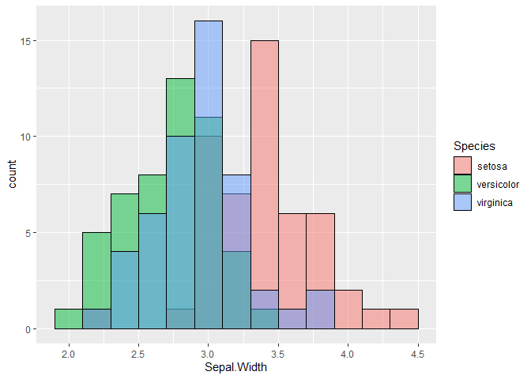<!-- -->

When there is a huge amount of datapoints, a frequency plot is better
for comparisons.

``` r
ggplot(data = iris, aes(x = Sepal.Width)) +
    geom_freqpoly(binwidth = 0.1)
```

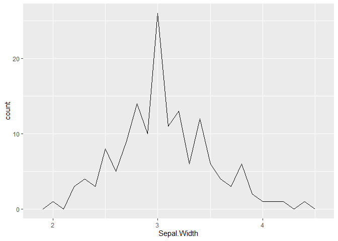<!-- -->

``` r
ggplot(data = iris, aes(x = Sepal.Width, color = Species)) +
    geom_freqpoly(binwidth = 0.1)
```

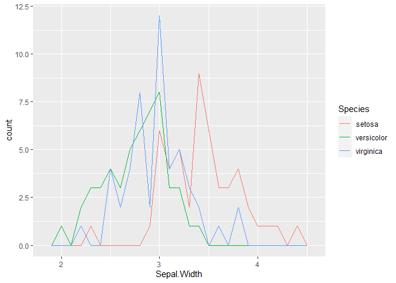<!-- -->

Another sibling of the histogram is the density plot. It specifies even
more on big datasets

``` r
ggplot(data = iris, aes(x = Sepal.Width, fill = Species)) +
    geom_density(alpha = 0.3)
```

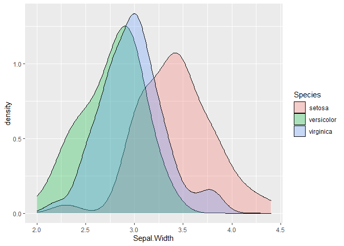<!-- -->

When you want to combine density plots and histograms, you need to use
`aes(y = ..density..)` to use the correct scaling of the data. We will
get into the topic of scaling in a later lecture even further.

``` r
ggplot(data = iris, aes(x = Sepal.Width, fill = Species)) +
    geom_histogram(
        binwidth = 0.2, color = "black",
        aes(fill = Species, y = ..density..)
    ) +
    geom_density(alpha = 0.3)
```

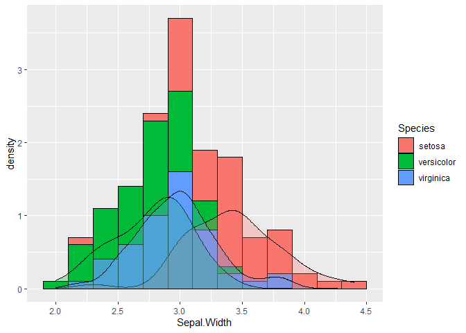<!-- -->

#### Exercise

Use the Petal Width data to create a histogram showing the overall
dataset and add density plots for each species.

### Barplots and siblings

To have more interesting barplots, we will create a small dataset with
more classes and already finished amount values.

``` r
data <- tibble(
    group = LETTERS[1:5],
    value = c(13, 7, 9, 21, 2)
)
```

#### base R

``` r
barplot(height = data$value)
```

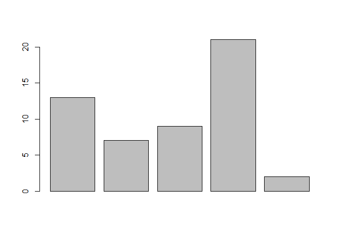<!-- -->

#### ggplot

``` r
# basic bar plot
ggplot(data = data, aes(x = group, y = value)) +
    geom_bar(stat = "identity")
```

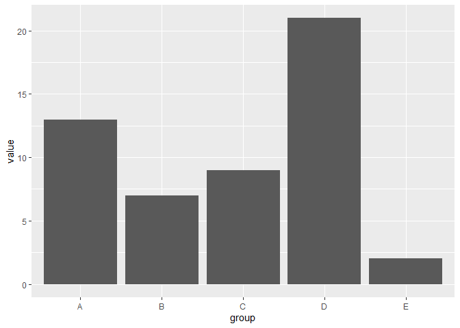<!-- -->

``` r
# basic pie chart
ggplot(data, aes(x = "", y = value, fill = group)) +
    geom_bar(stat = "identity", width = 1) +
    coord_polar("y", start = 0) # This is actually the key point
```

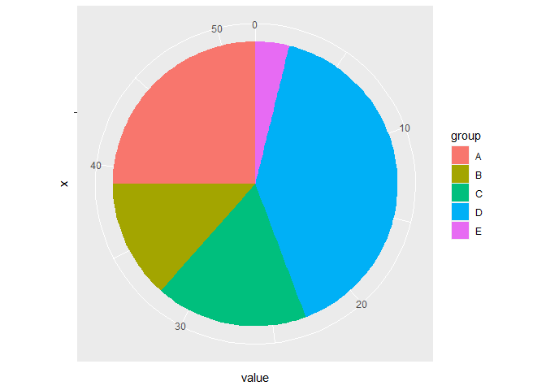<!-- -->

We will have a closer look on other plots in the future. But first we
need to get into data wrangling on more complex data sets

## Exercise

- Search and List for Advantages and Disadvantages of each kind of plot!
- Which scales of data are needed for which kind of plot?
