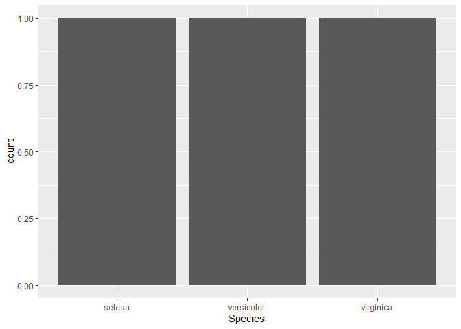

Lesson 04
================
Martin Reinhardt

# Data Wrangling

Todays topics:

- Dealing with NaN and missing
- Scaling Data
- Data Wrangling with real Data sets

Important Note: We start to use bigger and realistic datasets now which
might cost more computer hardware than expected. You should get your
access to the scientific computing: [SC Uni
Leipzig](https://www.urz.uni-leipzig.de/unsere-services/services-fuer-forschende/einstieg-ins-wissenschaftliche-rechnen).
A modern laptop with some GB of RAM should still be enough to run
everything anyways.

## Topic overview


## Importing Data

The task of importing data is the first when it comes to Data
Processing. Please download the CSV data before continuing. We will need
it later and the download takes some time:
[Data](https://datacatalog.worldbank.org/dataset/world-development-indicators)

### Data formats

There are many data formats for table data:

- Tabular text formats: CSV (.csv), TSV (.tsv), Table (.data) and more

- Spreadsheet formats: Excel (.xls, .xlsx), Open Document (.ods)

- other formats: JSON (.json), Stata files (.dta), SPSS data (.sav,
  .zsav, .por)

They each have advantages and disadvantages. To encourage platform
independence, we will stick with simple CSV data for all our projects.

Additional to these file formats, data can also be imported by public
data APIs. These are getting data through the internet on demand. Most
of these APIs are packaged in R packages.

In the [Tidyverse](https://www.tidyverse.org/) the according package for
reading files is called [readr](https://readr.tidyverse.org/). Don’t
forget to load the library.

``` r
library(tidyverse)
```

### Interlude: Symbols, values, missing values

``` r
x <- 1
x <- list(a = 1)
```

- `x` and `a` is a variable names or symbols.
- `1` is a value.
- `<-` is the assignment operator and assings a value to a symbol
- `x <- 1` is called an expression

Look in `?make.names` for valid variable names.
`Human Development Index` is not a valid variable name because it
contains spaces. You can still create symbols with that name using back
ticks.

``` r
x <- list(a = 1, `Human Development Index` = 2)
x$`hello world` <- 3
```

Often `"..."` can be used instead but not always.

R has a special value for missings: `NA` (Don’t mix it up with `NaN`)

``` r
x <- c(1, 2, 3, NA)
2 * x
```

    ## [1]  2  4  6 NA

`NA` propagates through calculations. Some functions have an option to
remove missings

``` r
mean(x)
```

    ## [1] NA

``` r
mean(x, na.rm = TRUE)
```

    ## [1] 2

This feature is not very spread among other programming languages.
Therefore, some formats are using specific values which are later
interpreted as `NA`s (Example: -9999)

### Interlude: Piping (Tidyverse)

`x %>% f` is equivalent to `f(x)`

So instead of `f(g(h(x)))` or

``` r
h_x <- h(x)
gh_x <- g(h_x)
fgh_x <- f(gh_x)
```

we can write `x %>% h %>% g %>% f`. This makes long chains of commands
more readable but can also be hard to debug.

`x %>% f(3)` is equivalent to `f(x, 3)` and `x %>% f(3, .)` is
equivalent to `f(3, x)`.

Arbitrary expression can also be used: `x %>% {. + 4}`

Especially in scripts or later R Markdown files, this technique makes
reading code much easier and structuring the source is easier. This also
improves maintainability.

A nice real Example: converting the iris data set to a tibble and plot
it:

``` r
iris %>%
  tibble %>% 
  ggplot(aes(x = Petal.Length, y = Petal.Width)) +
  geom_point(aes(color = Species, shape = Species))
```

<!-- -->

### Working Directory

To access data without giving the full path, but a relative path, it is
useful to set the working directory:

``` r
setwd("D:/RCourse_WS22/Lesson_04")
```

You can check the actual working directory with `getwd()`. When using
paths, please use slashes `/`and no backslashes `\`. Otherwise you might
run into problems.

### Data import with `readr`

The data is downloaded and can now be loaded into R. Unzipping is done
in our pipe. But we should check the contents of the archive
`WDIData.csv`:

- `WDIData.csv` contains the main data table.
- `WDISeries.csv` contains more information on the single indicators.
- `WDICountry.csv` contains more information on the countries and
  regions.

While the classic `read.csv` reads to a `data.frame` we want to use
`tibble` for our data. So we can use the tidyverse version of the
function, called `read_csv`. This function even handles small
non-standard things in a CSV file.

The function `unz` can decompress the zip-archive on the fly while
reading.

first save the location of the file according to your own computer and
then you can import the data.

``` r
filename = "../Data/WDI_csv.zip"
```

``` r
wdi_data <- 
  filename %>%
  unz("WDIData.csv" ) %>%
  read_csv
```

    ## New names:
    ## Rows: 383572 Columns: 67
    ## ── Column specification
    ## ──────────────────────────────────────────────────────── Delimiter: "," chr
    ## (4): Country Name, Country Code, Indicator Name, Indicator Code dbl (62): 1960,
    ## 1961, 1962, 1963, 1964, 1965, 1966, 1967, 1968, 1969, 1970, ... lgl (1): ...67
    ## ℹ Use `spec()` to retrieve the full column specification for this data. ℹ
    ## Specify the column types or set `show_col_types = FALSE` to quiet this message.
    ## • `` -> `...67`

``` r
head(wdi_data)
```

    ## # A tibble: 6 × 67
    ##   Country Na…¹ Count…² Indic…³ Indic…⁴ `1960` `1961` `1962` `1963` `1964` `1965`
    ##   <chr>        <chr>   <chr>   <chr>    <dbl>  <dbl>  <dbl>  <dbl>  <dbl>  <dbl>
    ## 1 Africa East… AFE     Access… EG.CFT…     NA     NA     NA     NA     NA     NA
    ## 2 Africa East… AFE     Access… EG.CFT…     NA     NA     NA     NA     NA     NA
    ## 3 Africa East… AFE     Access… EG.CFT…     NA     NA     NA     NA     NA     NA
    ## 4 Africa East… AFE     Access… EG.ELC…     NA     NA     NA     NA     NA     NA
    ## 5 Africa East… AFE     Access… EG.ELC…     NA     NA     NA     NA     NA     NA
    ## 6 Africa East… AFE     Access… EG.ELC…     NA     NA     NA     NA     NA     NA
    ## # … with 57 more variables: `1966` <dbl>, `1967` <dbl>, `1968` <dbl>,
    ## #   `1969` <dbl>, `1970` <dbl>, `1971` <dbl>, `1972` <dbl>, `1973` <dbl>,
    ## #   `1974` <dbl>, `1975` <dbl>, `1976` <dbl>, `1977` <dbl>, `1978` <dbl>,
    ## #   `1979` <dbl>, `1980` <dbl>, `1981` <dbl>, `1982` <dbl>, `1983` <dbl>,
    ## #   `1984` <dbl>, `1985` <dbl>, `1986` <dbl>, `1987` <dbl>, `1988` <dbl>,
    ## #   `1989` <dbl>, `1990` <dbl>, `1991` <dbl>, `1992` <dbl>, `1993` <dbl>,
    ## #   `1994` <dbl>, `1995` <dbl>, `1996` <dbl>, `1997` <dbl>, `1998` <dbl>, …

The country data and data on variables should also be read into R:

``` r
wdi_country <- 
  filename %>%
  unz("WDICountry.csv" ) %>%
  read_csv
```

    ## New names:
    ## Rows: 265 Columns: 31
    ## ── Column specification
    ## ──────────────────────────────────────────────────────── Delimiter: "," chr
    ## (25): Country Code, Short Name, Table Name, Long Name, 2-alpha code, Cur... dbl
    ## (3): National accounts reference year, Latest industrial data, Latest t... lgl
    ## (3): Alternative conversion factor, PPP survey year, ...31
    ## ℹ Use `spec()` to retrieve the full column specification for this data. ℹ
    ## Specify the column types or set `show_col_types = FALSE` to quiet this message.
    ## • `` -> `...31`

``` r
head(wdi_country)
```

    ## # A tibble: 6 × 31
    ##   Count…¹ Short…² Table…³ Long …⁴ 2-alp…⁵ Curre…⁶ Speci…⁷ Region Incom…⁸ WB-2 …⁹
    ##   <chr>   <chr>   <chr>   <chr>   <chr>   <chr>   <chr>   <chr>  <chr>   <chr>  
    ## 1 ABW     Aruba   Aruba   Aruba   AW      Aruban…  <NA>   Latin… High i… AW     
    ## 2 AFE     Africa… Africa… Africa… ZH      <NA>    "26 co… <NA>   <NA>    ZH     
    ## 3 AFG     Afghan… Afghan… Islami… AF      Afghan… "The r… South… Low in… AF     
    ## 4 AFW     Africa… Africa… Africa… ZI      <NA>    "22 co… <NA>   <NA>    ZI     
    ## 5 AGO     Angola  Angola  People… AO      Angola… "The W… Sub-S… Lower … AO     
    ## 6 ALB     Albania Albania Republ… AL      Albani…  <NA>   Europ… Upper … AL     
    ## # … with 21 more variables: `National accounts base year` <chr>,
    ## #   `National accounts reference year` <dbl>, `SNA price valuation` <chr>,
    ## #   `Lending category` <chr>, `Other groups` <chr>,
    ## #   `System of National Accounts` <chr>, `Alternative conversion factor` <lgl>,
    ## #   `PPP survey year` <lgl>, `Balance of Payments Manual in use` <chr>,
    ## #   `External debt Reporting status` <chr>, `System of trade` <chr>,
    ## #   `Government Accounting concept` <chr>, …

``` r
wdi_series <- 
  filename %>%
  unz("WDISeries.csv" ) %>%
  read_csv
```

    ## New names:
    ## • `` -> `...21`

    ## Warning: One or more parsing issues, call `problems()` on your data frame for details,
    ## e.g.:
    ##   dat <- vroom(...)
    ##   problems(dat)

    ## Rows: 1442 Columns: 21
    ## ── Column specification ────────────────────────────────────────────────────────
    ## Delimiter: ","
    ## chr (17): Series Code, Topic, Indicator Name, Short definition, Long definit...
    ## lgl  (4): Unit of measure, Related source links, Other web links, ...21
    ## 
    ## ℹ Use `spec()` to retrieve the full column specification for this data.
    ## ℹ Specify the column types or set `show_col_types = FALSE` to quiet this message.

``` r
head(wdi_series)
```

    ## # A tibble: 6 × 21
    ##   Series…¹ Topic Indic…² Short…³ Long …⁴ Unit …⁵ Perio…⁶ Base …⁷ Other…⁸ Aggre…⁹
    ##   <chr>    <chr> <chr>   <chr>   <chr>   <lgl>   <chr>   <chr>   <chr>   <chr>  
    ## 1 AG.AGR.… Envi… Agricu… <NA>    Agricu… NA      Annual  <NA>    <NA>    Sum    
    ## 2 AG.CON.… Envi… Fertil… <NA>    Fertil… NA      Annual  <NA>    <NA>    Weight…
    ## 3 AG.CON.… Envi… Fertil… <NA>    Fertil… NA      Annual  <NA>    <NA>    Weight…
    ## 4 AG.LND.… Envi… Agricu… <NA>    Agricu… NA      Annual  <NA>    Areas … Sum    
    ## 5 AG.LND.… Envi… Agricu… <NA>    Agricu… NA      Annual  <NA>    Areas … Weight…
    ## 6 AG.LND.… Envi… Arable… <NA>    Arable… NA      Annual  <NA>    <NA>    <NA>   
    ## # … with 11 more variables: `Limitations and exceptions` <chr>,
    ## #   `Notes from original source` <chr>, `General comments` <chr>, Source <chr>,
    ## #   `Statistical concept and methodology` <chr>, `Development relevance` <chr>,
    ## #   `Related source links` <lgl>, `Other web links` <lgl>,
    ## #   `Related indicators` <chr>, `License Type` <chr>, ...21 <lgl>, and
    ## #   abbreviated variable names ¹​`Series Code`, ²​`Indicator Name`,
    ## #   ³​`Short definition`, ⁴​`Long definition`, ⁵​`Unit of measure`, …

All important data parts are now loaded and can be dealt with.

## Tidying data

This step will be discussed in a later class

## Transform, filter and grouping data

We will step back to the iris data set to explain, what happens with the
following commands because the data is simpler. Getting to know the data
is usually a time-consuming step.

``` r
data <- iris %>% tibble
```

### Create, modify and delete columns

`mutate` is the command to deal with whole column operations. You can
easily add or delete columns

``` r
data %>%
  mutate(Genus = "Iris data set", Sepal.Length = NULL)
```

    ## # A tibble: 150 × 5
    ##    Sepal.Width Petal.Length Petal.Width Species Genus        
    ##          <dbl>        <dbl>       <dbl> <fct>   <chr>        
    ##  1         3.5          1.4         0.2 setosa  Iris data set
    ##  2         3            1.4         0.2 setosa  Iris data set
    ##  3         3.2          1.3         0.2 setosa  Iris data set
    ##  4         3.1          1.5         0.2 setosa  Iris data set
    ##  5         3.6          1.4         0.2 setosa  Iris data set
    ##  6         3.9          1.7         0.4 setosa  Iris data set
    ##  7         3.4          1.4         0.3 setosa  Iris data set
    ##  8         3.4          1.5         0.2 setosa  Iris data set
    ##  9         2.9          1.4         0.2 setosa  Iris data set
    ## 10         3.1          1.5         0.1 setosa  Iris data set
    ## # … with 140 more rows

Additionally it is possible to create new columns or modify them:

``` r
data %>% 
  mutate(isbig = Sepal.Length > 4)
```

    ## # A tibble: 150 × 6
    ##    Sepal.Length Sepal.Width Petal.Length Petal.Width Species isbig
    ##           <dbl>       <dbl>        <dbl>       <dbl> <fct>   <lgl>
    ##  1          5.1         3.5          1.4         0.2 setosa  TRUE 
    ##  2          4.9         3            1.4         0.2 setosa  TRUE 
    ##  3          4.7         3.2          1.3         0.2 setosa  TRUE 
    ##  4          4.6         3.1          1.5         0.2 setosa  TRUE 
    ##  5          5           3.6          1.4         0.2 setosa  TRUE 
    ##  6          5.4         3.9          1.7         0.4 setosa  TRUE 
    ##  7          4.6         3.4          1.4         0.3 setosa  TRUE 
    ##  8          5           3.4          1.5         0.2 setosa  TRUE 
    ##  9          4.4         2.9          1.4         0.2 setosa  TRUE 
    ## 10          4.9         3.1          1.5         0.1 setosa  TRUE 
    ## # … with 140 more rows

**Exercise** \* Create a tibble with Sepal leave data only, but numbers
are in inches \* Create a tibble, with an additional column
`bigger than mean`, which shows if a Sepal leave is wider than the mean
value

### Filtering

`filter`is the command to filter data

``` r
data %>%
  filter(Species == "virginica")
```

    ## # A tibble: 50 × 5
    ##    Sepal.Length Sepal.Width Petal.Length Petal.Width Species  
    ##           <dbl>       <dbl>        <dbl>       <dbl> <fct>    
    ##  1          6.3         3.3          6           2.5 virginica
    ##  2          5.8         2.7          5.1         1.9 virginica
    ##  3          7.1         3            5.9         2.1 virginica
    ##  4          6.3         2.9          5.6         1.8 virginica
    ##  5          6.5         3            5.8         2.2 virginica
    ##  6          7.6         3            6.6         2.1 virginica
    ##  7          4.9         2.5          4.5         1.7 virginica
    ##  8          7.3         2.9          6.3         1.8 virginica
    ##  9          6.7         2.5          5.8         1.8 virginica
    ## 10          7.2         3.6          6.1         2.5 virginica
    ## # … with 40 more rows

Here you really need to pay attention about the datatype. Also it is
important ot use the comparison `==` and not the simple equality sign
`=`

Another suitable function is `select` which concentrates the output to
specific coloums:

``` r
data %>%
  select(Petal.Length)
```

    ## # A tibble: 150 × 1
    ##    Petal.Length
    ##           <dbl>
    ##  1          1.4
    ##  2          1.4
    ##  3          1.3
    ##  4          1.5
    ##  5          1.4
    ##  6          1.7
    ##  7          1.4
    ##  8          1.5
    ##  9          1.4
    ## 10          1.5
    ## # … with 140 more rows

Both together can be used to limit the output:

``` r
data %>%
  filter(Species == "setosa") %>%
  select(Petal.Length, Petal.Width)
```

    ## # A tibble: 50 × 2
    ##    Petal.Length Petal.Width
    ##           <dbl>       <dbl>
    ##  1          1.4         0.2
    ##  2          1.4         0.2
    ##  3          1.3         0.2
    ##  4          1.5         0.2
    ##  5          1.4         0.2
    ##  6          1.7         0.4
    ##  7          1.4         0.3
    ##  8          1.5         0.2
    ##  9          1.4         0.2
    ## 10          1.5         0.1
    ## # … with 40 more rows

**Exercise** \* Create a tibble where you just show the individuals,
where the Sepal width is bigger than the mean \* Create a tibble where
all Versicolor species are listed which have a Petal length between 4
and 5. Use the command `between` for this. \* Create a tibble with
Species and Sepal length only

### Grouping

Grouping is a process in the middle of the pipeline which is used by
further commands later in the pipe. It is a good technique to get
initial ideas for further computations or tests.

``` r
data %>%
  group_by(Species) %>%
  summarize_all(mean)
```

    ## # A tibble: 3 × 5
    ##   Species    Sepal.Length Sepal.Width Petal.Length Petal.Width
    ##   <fct>             <dbl>       <dbl>        <dbl>       <dbl>
    ## 1 setosa             5.01        3.43         1.46       0.246
    ## 2 versicolor         5.94        2.77         4.26       1.33 
    ## 3 virginica          6.59        2.97         5.55       2.03

You can also use other methods:

``` r
data %>%
  group_by(Species) %>%
  count
```

    ## # A tibble: 3 × 2
    ## # Groups:   Species [3]
    ##   Species        n
    ##   <fct>      <int>
    ## 1 setosa        50
    ## 2 versicolor    50
    ## 3 virginica     50

``` r
data %>%
  group_by(Species) %>%
  count %>%
  ggplot() +
  geom_bar(aes(x=Species))
```

<!-- -->

**Exercise** Try to explain in your own words, which information the
following table holds

``` r
data %>%
  group_by(Petal.Length>mean(Petal.Length)) %>%
  summarise(mean(Sepal.Length))
```

    ## # A tibble: 2 × 2
    ##   `Petal.Length > mean(Petal.Length)` `mean(Sepal.Length)`
    ##   <lgl>                                              <dbl>
    ## 1 FALSE                                               5.04
    ## 2 TRUE                                                6.34

### Pivoting

Pivot tables are a special version of grouped tables. They allow fast
exploration of big data sets. Pivot tables don’t have an individual
view, but more an overview of the data.

The `iris` dataset has two dimensions: `Traits` and `Species`. What are
the different ways that we can represent this in tabular form?

``` r
mean_data <- data %>%
  group_by(Species) %>%
  summarize_all(mean)
mean_data
```

    ## # A tibble: 3 × 5
    ##   Species    Sepal.Length Sepal.Width Petal.Length Petal.Width
    ##   <fct>             <dbl>       <dbl>        <dbl>       <dbl>
    ## 1 setosa             5.01        3.43         1.46       0.246
    ## 2 versicolor         5.94        2.77         4.26       1.33 
    ## 3 virginica          6.59        2.97         5.55       2.03

pivoting longer means you spread the table to more variables. Pivoting
wider means you stretch the number of columns but reduce the number of
rows.

``` r
mean_data %>%
  pivot_longer(Sepal.Length:Petal.Width, names_to = "Trait")
```

    ## # A tibble: 12 × 3
    ##    Species    Trait        value
    ##    <fct>      <chr>        <dbl>
    ##  1 setosa     Sepal.Length 5.01 
    ##  2 setosa     Sepal.Width  3.43 
    ##  3 setosa     Petal.Length 1.46 
    ##  4 setosa     Petal.Width  0.246
    ##  5 versicolor Sepal.Length 5.94 
    ##  6 versicolor Sepal.Width  2.77 
    ##  7 versicolor Petal.Length 4.26 
    ##  8 versicolor Petal.Width  1.33 
    ##  9 virginica  Sepal.Length 6.59 
    ## 10 virginica  Sepal.Width  2.97 
    ## 11 virginica  Petal.Length 5.55 
    ## 12 virginica  Petal.Width  2.03

You can also concentrate on a special column with
`pivot_longer(!Species, names_to = "Trait")`

``` r
mean_data %>%
  pivot_wider(names_from = "Species", values_from = !Species)
```

    ## # A tibble: 1 × 12
    ##   Sepal.Length…¹ Sepal…² Sepal…³ Sepal…⁴ Sepal…⁵ Sepal…⁶ Petal…⁷ Petal…⁸ Petal…⁹
    ##            <dbl>   <dbl>   <dbl>   <dbl>   <dbl>   <dbl>   <dbl>   <dbl>   <dbl>
    ## 1           5.01    5.94    6.59    3.43    2.77    2.97    1.46    4.26    5.55
    ## # … with 3 more variables: Petal.Width_setosa <dbl>,
    ## #   Petal.Width_versicolor <dbl>, Petal.Width_virginica <dbl>, and abbreviated
    ## #   variable names ¹​Sepal.Length_setosa, ²​Sepal.Length_versicolor,
    ## #   ³​Sepal.Length_virginica, ⁴​Sepal.Width_setosa, ⁵​Sepal.Width_versicolor,
    ## #   ⁶​Sepal.Width_virginica, ⁷​Petal.Length_setosa, ⁸​Petal.Length_versicolor,
    ## #   ⁹​Petal.Length_virginica

With both functions combined it is possible to create nice overviews:

``` r
mean_data %>%
  pivot_longer(!Species, names_to = "Trait") %>%
  pivot_wider(id_cols = "Trait", names_from = "Species")
```

    ## # A tibble: 4 × 4
    ##   Trait        setosa versicolor virginica
    ##   <chr>         <dbl>      <dbl>     <dbl>
    ## 1 Sepal.Length  5.01        5.94      6.59
    ## 2 Sepal.Width   3.43        2.77      2.97
    ## 3 Petal.Length  1.46        4.26      5.55
    ## 4 Petal.Width   0.246       1.33      2.03

## Exercise

Explore the WDI data!

Some helpers for the start:

``` r
glimpse()
head()

wdi_series %>%
  select(`Series Code`, `Indicator Name`)

wdi_series %>%
  filter(str_detect(`Indicator Name`, "Population density")) %>%
  { .$`Long definition` }

descriptions <- wdi_series %>% select(`Series Code`, `Indicator Name`, `Long definition`)
descriptions[1:3,]
```

- What are the dimensions of the WDI?

- How could we pivot the data?

- How is the following data managed?

``` r
wdi_data_piv <- wdi_data %>%
  pivot_longer(`1960`:`2020`,
               names_to = "Year",
               values_drop_na = TRUE) %>%
  mutate(Year = as.integer(Year)) %>%
  pivot_wider(id_cols = c("Country Code", "Year"), names_from = "Indicator Code")
wdi_data_piv
```

    ## # A tibble: 16,165 × 1,444
    ##    `Country Code`  Year EG.CFT…¹ EG.CF…² EG.CF…³ EG.EL…⁴ EG.EL…⁵ EG.EL…⁶ NY.AD…⁷
    ##    <chr>          <int>    <dbl>   <dbl>   <dbl>   <dbl>   <dbl>   <dbl>   <dbl>
    ##  1 AFE             2000     11.4    3.50    32.3    19.8    8.47    53.6   NA   
    ##  2 AFE             2001     11.8    3.69    32.7    19.9   NA       53.2   NA   
    ##  3 AFE             2002     12.2    3.85    33.1    21.5   NA       55.3   NA   
    ##  4 AFE             2003     12.5    4.07    33.7    22.5    9.70    56.3    4.95
    ##  5 AFE             2004     12.9    4.31    34.2    23.8   10.9     57.0    4.78
    ##  6 AFE             2005     13.4    4.54    34.7    23.5   10.4     58.1    8.13
    ##  7 AFE             2006     13.9    4.83    35.2    24.8   12.4     58.7    8.65
    ##  8 AFE             2007     14.3    5.04    35.9    26.8   12.4     60.9    2.92
    ##  9 AFE             2008     14.8    5.31    36.2    25.9   12.9     59.0   -3.12
    ## 10 AFE             2009     15.2    5.54    36.7    26.2   15.3     61.4    6.06
    ## # … with 16,155 more rows, 1,435 more variables: NY.ADJ.NNTY.KD <dbl>,
    ## #   NY.ADJ.NNTY.CD <dbl>, NY.ADJ.NNTY.PC.KD.ZG <dbl>, NY.ADJ.NNTY.PC.KD <dbl>,
    ## #   NY.ADJ.NNTY.PC.CD <dbl>, NY.ADJ.SVNX.GN.ZS <dbl>, NY.ADJ.SVNG.GN.ZS <dbl>,
    ## #   NY.ADJ.DCO2.GN.ZS <dbl>, NY.ADJ.DKAP.GN.ZS <dbl>, NY.ADJ.AEDU.GN.ZS <dbl>,
    ## #   NY.ADJ.DNGY.GN.ZS <dbl>, NY.ADJ.ICTR.GN.ZS <dbl>, NY.ADJ.DMIN.GN.ZS <dbl>,
    ## #   NY.ADJ.DRES.GN.ZS <dbl>, NY.ADJ.DFOR.GN.ZS <dbl>, NY.ADJ.NNAT.GN.ZS <dbl>,
    ## #   NY.ADJ.DPEM.GN.ZS <dbl>, SP.ADO.TFRT <dbl>, SP.POP.DPND <dbl>, …

- What is this exact number?

``` r
wdi_data_piv %>%
  select(`Country Code`, Year, NY.ADJ.NNTY.PC.KD) %>%
  filter(`Country Code` == "DEU" & Year == 2010)
```

    ## # A tibble: 1 × 3
    ##   `Country Code`  Year NY.ADJ.NNTY.PC.KD
    ##   <chr>          <int>             <dbl>
    ## 1 DEU             2010            31413.
