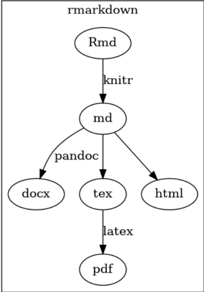

# R Projects and RMarkdown

Todays topics:

- Creating RProjects to create whole workflow solutions
- Communications with RMarkdown

## Topic Overview

Today we want to explore ways to communicate findings from scientific
results. So far we used visualization techniques and scripts.

## R Projects

The communication attempt should be combined with a possibility to bring
data, scripts, workflows and final reports together in one solution.
This is called an R project.

A nice directory structure for data driven projects is:

    .
    └── AwesomeProject
        ├── src
        ├── output
        ├── data
        │   ├── raw
        │   └── processed
        ├── README.md
        ├── run_analyses.R 
        └── .gitignore

Don’t see everything too strict, but really try to manage everything in
a nice way. Principles are more important than rules in this setting.
There are other possible directory structures, which most likely have
the same rough idea, but other names for each folder

Please see the structure as a nice idea to also get structure in your
projects. They are not strict and not mandatory. But try to adapt for
more productivity.

### `data`

Generally try to distinct between raw data (read only) and generated
data. Raw data should always have backups (e.g. on backup servers,
cloud, internet accessible locations). If you work with generated data,
this should always be disposable. It means you have R scripts which
generate them in case you want them generated new.

### `output`

This folder is reserved for all kinds of outputs. This includes rendered
markdown files (later in class today) but also plots you might want to
use later in other areas of reseach or external publications. Sometimes
R scripts also generate or just preprocess data. finalized output
formats are also stored here in this case.

### `src`

This folder is the location, where all your scripts which are
responsible for generations, computations and data wrangling reside. Try
to put all coding in such scripts to have a nice documentation about
your work In the best case somebody can clone your project and
comprehend all single parts of your workflow.

### `README`

This file is usually written in MArkdown (later) and gives a short
description about your project and the way you download or install the
data, if needed.

### `run_analysis.R`

In many projects, there exist a script which runs all analysis scripts
and plotting functions to generate all solutions and results. This
enables users of your code to clone the project and create the according
results without completely understanding each part of the workflow you
established. You should try to keep this file tidied up and solemly
relate on the scripts in the `src` folder.

### additional hints for your project structure

- only use relative paths and never absolute paths
- Create a new R project for each data analysis project
- keep all scripts here
- keep all your outputs here and make them disposable
- in case you know how to use version control: use a new repository for
  every project
- Save your R history here

## Markdown and R Markdown for communication and documentation

Markdown is a way to prototype text fast and render it to different
outputs. A minimal set of patterns make this possible and is used in
broad areas all over the internet. Additional there is R markdown. with
`.Rmd` files. These combine R scripts and Markdown to generate nice
reports ready to publish. You can even create nice slides or homepages.
The speciality of R Markdown is, that you can include R commands which
are executed prior to the markdown itself.

Download the sample file `Example.Rmd` for a better understanding, what
is possible. You can render the file with

    library(rmarkdown)
    render("Example.Rmd")

A full tutorial on RMarkdown can be found
[here](https://rmarkdown.rstudio.com). So far we want to stay with
simple documents. But for the submission you can use everything which
comes into your mind.

## Exercise

Today there is a combined exercise which brings all techniques together
you learned so far. The final result should be a minimal report which
states the status of renewable and nuclear energy in different countries
based on the WDI data like in our last class. Add some time series
plots, plots on maps, Annotated plots and more. Use your imagination!
It’s about the number of examples you add, not the result. Maybe you can
find a time series where you can add a linear model? Don’t care about
the statistics too much, but on working with the tools.

1.  create a R Project with an according structure
2.  add a Readme file which explains what the project is for
3.  add the data to the data folder
4.  write a function `init_data` which reads all data needed for the
    project
5.  write a function `prepare data` which creates a tibble with all
    necessary data you need for the final result
6.  write a functions for each plot you want to include into your
    project.
7.  create a `result.Rmd` file in `src` which is a basis for the final
    report
8.  create a `.R` file in the main directory of the Project which run
    all important functions you need for the reprt and at the end
    creates a pdf in `output` based on the RMarkdown file. You can find
    the according functions you need for this
    [here](https://pkgs.rstudio.com/rmarkdown/reference/render.html)
9.  Add some texts in the documents, lists, graphs, maybe small tables?
    Make it fancy! Maybe change the output to a html webpage
