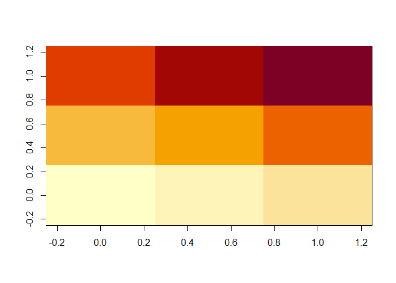
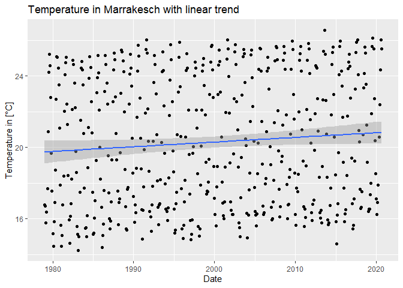

# NetCDF data, time series and first raster

Before you start: download and unzip the ERA5 data from moodle. You can
find a directory there with all data we will need. Also the WDI data was
added there.

Also start a project and act accordingly with the ideas we learned last
time.

Todays topics:

- Recap: Projects and RMarkdown
- Understanding NetCDF
- Using temperature data

## Topic Overview

Today we want to continue to explore ways to communicate findings from
scientific results. We already started with Projects and did first
experiments. Today we want to continue with everything and get deeper
understanding.


## General Raster Graphics

- *Matrix* explicit in space.
- Each entry of the *matrix* is a *cell*.
- Each *cell* has a location in space and a size.
- The smaller the pixel, the higher the resolution.
- Rasters are usually regularly spaced in their coordinate system (this
  may also depend on the projection).

``` r
x <- matrix(1:9, 3)
image(x)
```

<!-- -->

## Data Cubes

- a geographical raster image includes the world map
- higher resolution increases data size
- not just images, but also time series per pixel are common (4D Cubes)
- Data Cubes (speciality of Leipzig: RSC4Earth)

**Exercise**

- How big is a raster, which covers the entire world with a resolution
  of 0.01 degrees and holds 64 bits of data in each pixel?
- Discuss: pivot tables vs. rasters

### NetCDF Files

- Network Common Data Form
- a de facto standard for raster data in the geographical context
- includes data, description, axes and more
- usually axes with longitude, latitude, time
- fill values and missing values

Alternatives:

- Zarr format (this is the future)
- GeoTIFF (easy to manage)
- HDF images (proprietary)
- GRIB (mainly used in meteorology)
- and more or less specialized ones

From NetCDF you can extract the axis data with the following commands.
Don’t forget to load the `ncdf4` library and use the correct path. We
will later also need the `tidyverse` library

``` r
library(ncdf4)
library(tidyverse)
```

``` r
t2m_nc <- nc_open("data/era5_temperature2m.nc")
t2m_nc
```

    ## File ../data/era5_temperature2m.nc (NC_FORMAT_64BIT):
    ## 
    ##      1 variables (excluding dimension variables):
    ##         short t2m[longitude,latitude,expver,time]   
    ##             scale_factor: 0.00176319797961702
    ##             add_offset: 257.703670097788
    ##             _FillValue: -32767
    ##             missing_value: -32767
    ##             units: K
    ##             long_name: 2 metre temperature
    ## 
    ##      4 dimensions:
    ##         longitude  Size:1440 
    ##             units: degrees_east
    ##             long_name: longitude
    ##         latitude  Size:721 
    ##             units: degrees_north
    ##             long_name: latitude
    ##         expver  Size:2 
    ##             long_name: expver
    ##         time  Size:504 
    ##             units: hours since 1900-01-01 00:00:00.0
    ##             long_name: time
    ##             calendar: gregorian
    ## 
    ##     2 global attributes:
    ##         Conventions: CF-1.6
    ##         history: 2021-01-13 09:06:50 GMT by grib_to_netcdf-2.16.0: /opt/ecmwf/eccodes/bin/grib_to_netcdf -S param -o /cache/data9/adaptor.mars.internal-1610528645.191719-26199-4-cbd610d5-299e-4228-9031-80a56f4ee5e9.nc /cache/tmp/cbd610d5-299e-4228-9031-80a56f4ee5e9-adaptor.mars.internal-1610528645.192221-26199-2-tmp.grib

because the date information is tricky to work with, we will have
several different time axes to model our data accordingly and at the
same time have the chance to create nice plots.

``` r
t2m_nc_lon <- ncvar_get(t2m_nc, "longitude")
t2m_nc_lat <- ncvar_get(t2m_nc, "latitude")
t2m_nc_time <- ncvar_get(t2m_nc, "time")
t2m_nc_tax <- as.Date(t2m_nc_time / 24, origin = "1900-01-01 00:00:00.0")
head(t2m_nc_tax)
```

    ## [1] "1979-01-01" "1979-02-01" "1979-03-01" "1979-04-01" "1979-05-01"
    ## [6] "1979-06-01"

We will also create an index variable for the time. You will understand
why we need it later.

``` r
t2m_nc_idx <- seq_along(t2m_nc_tax)
```

So before we go into the map data more concentrated, let’s have a look
at some of the time series. To load a specific location you need the
correct location as an index. Remember: The data has a spatial
resolution of 0.25

``` r
t2m_nc_lat[300]
```

    ## [1] 15.25

``` r
t2m_nc_lon[300]
```

    ## [1] 74.75

**Exercise**

- Write a function, which gives you the index to the closest value of a
  latitude coordinate. Example: `getLatIdx(2.77)` delivers `350`
- Tip for rounding: `round(2.77*4)/4`
- Tip for searching for the index: `which(t2m_nc_lat == 2.75)`
- Write a function which gives you the indices of specific coordinates
  of lat and lon coordinates. Example: `getLonLan(2.77, 13.95)` delivers
  the array `(57, 350)`

## Time series modeling

To get a time series at a location with the index we need to access the
netcdf file:

``` r
temperature <- ncvar_get(t2m_nc, "t2m",
  start = c(LONGITUDE, LATITUDE, 1, TIME_START_IDX),
  dcount = c(1, 1, 1, TIME_END_IDX)) - 273.15
```

``` r
temperature <- ncvar_get(t2m_nc, "t2m",
  start = c(300, 300, 1, 1),
  count = c(1, 1, 1, 504)) - 273.15
```

**Exercise**

- What does the factor `- 273.15` mean?
- We want to find out about the temperature time series on a location on
  earth. Pick a location, find out about the coordinates and get the
  according indices. Check if you are still on land and not above water
  (The data there has more quality)
- Create a tibble with the variables temperature, time_index and
  time_tax (Don’t forget to load tidyverse)
- use `ggplot` to plot the time series and add a linear model

Here is an example output:

<!-- -->
