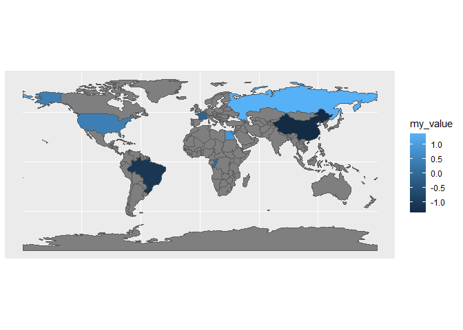
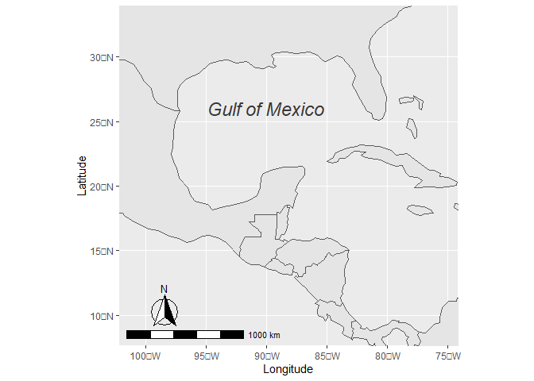

# Geo Data Plotting II

Todays topics:

- Recap all Geo data methods
- customize plots
- Plotting single points in maps
- more fancy plots in general

## Topic Overview

Today we want to get even deeper into the topic of plotting geographic
data. Also, plots which are really advanced will be shown. To make the
plots easier available to you, we will use dummy data or small tidy data
sets only.


As always: We will work with the tidyverse ecosystem

``` r
library(tidyverse)
```

    ## ── Attaching packages ─────────────────────────────────────── tidyverse 1.3.2 ──
    ## ✔ ggplot2 3.4.0      ✔ purrr   0.3.5 
    ## ✔ tibble  3.1.8      ✔ dplyr   1.0.10
    ## ✔ tidyr   1.2.1      ✔ stringr 1.4.1 
    ## ✔ readr   2.1.3      ✔ forcats 0.5.2 
    ## ── Conflicts ────────────────────────────────────────── tidyverse_conflicts() ──
    ## ✖ dplyr::filter() masks stats::filter()
    ## ✖ dplyr::lag()    masks stats::lag()

## general maps with `sf` (partly recap)

Shapes are delivered through the `ne_countries` function. There we just
make sure to load the data as `sf` which means simple features. These
represent a special kind of data which can be plotted without any
problems.

``` r
library(sf)
```

    ## Linking to GEOS 3.9.3, GDAL 3.5.2, PROJ 8.2.1; sf_use_s2() is TRUE

``` r
library(rnaturalearth)
library(rnaturalearthdata)

# get countries
countries_sf <- ne_countries(returnclass = "sf")
countries_sf %>% ggplot() + geom_sf()
```

<!-- -->

In most cases we want to show specific values based on the country. In
the best case, these are based on ISO 3166 codes of countries (see
[here](https://en.wikipedia.org/wiki/List_of_ISO_3166_country_codes)).
Let’s create a tibble with some of these and some random values:

``` r
country_data <- tibble(countrycode = c("BRA", "CHN", "FRA", "RUS", "EGY", "USA", "COG"), my_value = rnorm(7))
```

Now we want to bring those things together. We need to keep the original
data in its original state. Otherwise the plotting might become
difficult. Therefore we simply join our data with a left join to keep
all countries:

``` r
map_data <- left_join(countries_sf, country_data, by = c("iso_a3" = "countrycode"))
```

**Exercise: ** What is the difference between an inner join and a left
join?

To map all known values, we want to fill the country with the value. In
case no data was found, a `NA` will be used.

``` r
ggplot() +
  geom_sf(data = map_data, aes(fill=my_value))
```

<!-- -->

In many cases it is important to control the plotting more specific.
Here, `scale_fill_gradientn` and other functions might help a lot:

``` r
ggplot() +
  geom_sf(data = map_data, aes(fill=my_value)) +
  scale_fill_gradientn(colours = c("blue","green","red"), # gradient colors
                       na.value="white", # how NAs are treated
                       limits=c(-2,2), # the limits of colors
                       oob=scales::squish # out of bounds values are squished into the bounds (default is NA)
                       ) +
  coord_sf(xlim=c(-180, 180),ylim=c(-20,70), expand = FALSE) # crops the map shows ticks around it
```

<!-- -->

Also more complex CRS projections are possible

``` r
ggplot() +
  geom_sf(data = map_data, aes(fill=my_value)) +
  coord_sf(crs = "+proj=laea +lat_0=52 +lon_0=10 +ellps=GRS80")
```

<!-- --> Next to these
plots based on the country-codes, it is also possible to use other
joining methods. Here are some more interesting column, you might to
want to look at:

``` r
levels(factor(countries_sf$income_grp))
```

    ## [1] "1. High income: OECD"    "2. High income: nonOECD"
    ## [3] "3. Upper middle income"  "4. Lower middle income" 
    ## [5] "5. Low income"

``` r
levels(factor(countries_sf$economy))
```

    ## [1] "1. Developed region: G7"    "2. Developed region: nonG7"
    ## [3] "3. Emerging region: BRIC"   "4. Emerging region: MIKT"  
    ## [5] "5. Emerging region: G20"    "6. Developing region"      
    ## [7] "7. Least developed region"

``` r
levels(factor(countries_sf$subregion))
```

    ##  [1] "Antarctica"                "Australia and New Zealand"
    ##  [3] "Caribbean"                 "Central America"          
    ##  [5] "Central Asia"              "Eastern Africa"           
    ##  [7] "Eastern Asia"              "Eastern Europe"           
    ##  [9] "Melanesia"                 "Middle Africa"            
    ## [11] "Northern Africa"           "Northern America"         
    ## [13] "Northern Europe"           "Seven seas (open ocean)"  
    ## [15] "South-Eastern Asia"        "South America"            
    ## [17] "Southern Africa"           "Southern Asia"            
    ## [19] "Southern Europe"           "Western Africa"           
    ## [21] "Western Asia"              "Western Europe"

``` r
levels(factor(countries_sf$region_un))
```

    ## [1] "Africa"                  "Americas"               
    ## [3] "Antarctica"              "Asia"                   
    ## [5] "Europe"                  "Oceania"                
    ## [7] "Seven seas (open ocean)"

``` r
levels(factor(countries_sf$region_wb))
```

    ## [1] "Antarctica"                 "East Asia & Pacific"       
    ## [3] "Europe & Central Asia"      "Latin America & Caribbean" 
    ## [5] "Middle East & North Africa" "North America"             
    ## [7] "South Asia"                 "Sub-Saharan Africa"

``` r
levels(factor(countries_sf$region_un))
```

    ## [1] "Africa"                  "Americas"               
    ## [3] "Antarctica"              "Asia"                   
    ## [5] "Europe"                  "Oceania"                
    ## [7] "Seven seas (open ocean)"

These can also be used to plot maps.

``` r
ggplot() +
  geom_sf(data = countries_sf, aes(fill=continent))
```

<!-- -->

But also more complex situations are possible:

``` r
Asia <-ne_countries(scale="medium",continent='asia',returnclass="sf")
ggplot()+geom_sf(data= Asia,aes(fill=economy))+
  scale_fill_brewer(palette="Set2")+
  theme_classic()+
  labs(x="",y="",title="Asia Countries by Economy")+
  theme(axis.text.x = element_blank(),axis.text.y=element_blank(),
        axis.line = element_blank(),axis.ticks = element_blank())
```

<!-- -->

You can find information about the data
[here](https://www.naturalearthdata.com/) and also
[here](https://github.com/ropensci/rnaturalearth) in case you want to
use them in a publication and need more information.

## Recap: Rasters with `terra`and `tidyterra`

``` r
library(terra)
library(tidyterra)
t2m_ras <- rast("data/era5_temperature2m.nc")
t2m_ras_new <- t2m_ras["t2m_expver=1_*"]
t2m_ras_new <- t2m_ras_new[[1:501]]
ggplot() + geom_spatraster(data=t2m_ras_new[[1]]) + geom_sf()
```

<!-- -->

Additionally you can add the world map without filling, but with the
borders alone. Here we load the packages again we know from former
classes:

``` r
countries_sf <- ne_countries(returnclass = "sf")
ggplot() +
  geom_spatraster(data=t2m_ras_new[[1]]) +
  geom_sf(data=countries_sf, fill=NA)
```

<!-- -->

As you can see the problem of the different value areas $[-180, 180)$
vs. $[0, 360)$ occurs. This problem can be handled with the function
`rotate`.

``` r
ggplot() +
  geom_spatraster(data=rotate(t2m_ras_new[[1]])) +
  geom_sf(data=countries_sf, fill=NA)
```

<!-- -->

You can also use more tricks you learned from previous plots:

``` r
ggplot() +
  geom_spatraster(data=rotate(t2m_ras_new[[1]])) +
  geom_sf(data=countries_sf, fill=NA) +
  coord_sf(xlim=c(-20, 35),ylim=c(30,60), expand = FALSE)
```

<!-- -->

More information about this way of plotting can be found in the last
exercise and the finished Raster Example project you can download from
Moodle.

## Points on maps

One last topic is the plotting of single points onto maps. As our
example we will choose volcanic eruptions, which are cataloged by the
[Global Volcanism Program](https://volcano.si.edu/search_eruption.cfm)
of the Smithsonian Institute. This data collects all confirmed volcanic
eruptions since the beginning of the holoscene.

The data is only roughly cleared of unused variables and additional
information and then saved as CSV through Excel.

We load the data through the `tidyverse` operation `read_csv2`, because
the default Excel delimiter is a `;` and a `,` is used as decimal point.
We also have to skip the first line because it has the title of the
dataset saved. The positional arguments are in the range \[-180, 180).

``` r
volcanos <- read_csv2("data/GVP_Eruption_Results.csv", skip=1)
```

    ## ℹ Using "','" as decimal and "'.'" as grouping mark. Use `read_delim()` for more control.

    ## Rows: 9899 Columns: 13
    ## ── Column specification ────────────────────────────────────────────────────────
    ## Delimiter: ";"
    ## chr  (2): Volcano Name, End Year Modifier
    ## dbl (11): Volcano Number, Eruption Number, VEI, Start Year, Start Month, Sta...
    ## 
    ## ℹ Use `spec()` to retrieve the full column specification for this data.
    ## ℹ Specify the column types or set `show_col_types = FALSE` to quiet this message.

Now we can plot the positions already through

``` r
volcanos %>% ggplot() +
  aes(Longitude, Latitude) +
  geom_point()
```

<!-- -->

In most cases we want to add a map into the background to show a better
exact location of the volcanic eruptions. For this we try to be more
specific for the plot and put the data argument where we actually need
it.

``` r
ggplot() +
  geom_point(
    data = volcanos, 
    aes(Longitude, Latitude)
  )
```

<!-- -->

Now it is easy to add the map

``` r
ggplot() +
  geom_sf(
    data = countries_sf, fill = "lightgreen"
  ) +
  geom_point(
    data = volcanos, 
    aes(Longitude, Latitude)
  )
```

<!-- -->

This example is actually a good example to show the order of different
layers. The map should be the background and not the foreground.
Otherwise it might cover locations of the eruptions:

``` r
ggplot() +
  geom_point(
    data = volcanos, 
    aes(Longitude, Latitude)
  ) + 
  geom_sf(
    data = countries_sf, fill = "lightgreen"
  )
```

<!-- -->

**Exercise**

- Create a tibble, which includes all volcanic eruptions since 2020 with
  data about the volcanic eruption index (VEI).
- Plot these data onto the world map. Use `alpha = 0.5` in the
  `geom_point` function and `size = VEI` inside the `aes` to create a
  nice plot.

## Annotations on maps

Next to points, it is also useful to add direct annotations onto maps.
Let’s have a look at the gulf of Mexico.

``` r
ggplot(data = countries_sf) +
    geom_sf() +
    coord_sf(xlim = c(-102.15, -74.12), ylim = c(7.65, 33.97), expand = FALSE)
```

<!-- -->

For better plots we add the `ggspatial` package to add a scale bar and a
northing arrow (This scale bar is not 100% accurate!):

``` r
library(ggspatial)
```

Also we can annotate specific positions.

``` r
ggplot(data = countries_sf) +
  geom_sf() +
  coord_sf(
    xlim = c(-102.15, -74.12), ylim = c(7.65, 33.97), expand = FALSE
  ) +
  annotation_scale(
    location = "bl", width_hint = 0.5
  ) +
  annotation_north_arrow(
    location = "bl", 
    pad_x = unit(0.75, "cm"), pad_y = unit(0.5, "cm"),
    style = north_arrow_fancy_orienteering
  ) +
  annotate(geom = "text", x = -90, y = 26, label = "Gulf of Mexico", 
    fontface = "italic", color = "grey22", size = 6) +
  xlab("Longitude") + ylab("Latitude")
```

    ## Scale on map varies by more than 10%, scale bar may be inaccurate

<!-- -->

Even more annotations can be made. But before we will introduce some
data for cities in Florida. These need to be converted to “simple
feature” data with conversions to the “EPSG:4326” geo reference system.
Note the difference between text annotations and geometric text
positions.

``` r
flcities <- tibble(city = c("Miami", 
    "Tampa", "Orlando", "Jacksonville", "Sarasota", "Tallahassee"), lat = c(25.7616798, 
    27.950575, 28.5383355, 30.3321838, 27.3364347, 30.438736), lng = c(-80.1917902, 
    -82.4571776, -81.3792365, -81.655651, -82.5306527,  -84.280633), capitol = c(FALSE, FALSE, FALSE, FALSE, FALSE, TRUE))
flcities <- st_as_sf(flcities, coords=c("lng","lat"), crs=4326, remove = FALSE)
```

``` r
ggplot() +
  geom_sf(
    data = countries_sf
  ) +
  geom_sf(
    data=flcities
  ) +
  coord_sf(
    xlim = c(-88, -78), ylim = c(24.5, 33), expand = FALSE
  ) +
  geom_text(
    data = flcities, aes(x = lng, y = lat, label = city), 
    fontface = "bold"
  ) +
  annotation_scale(
    location = "bl", width_hint = 0.5
  ) +
  annotation_north_arrow(
    location = "bl", 
    pad_x = unit(0.75, "cm"), pad_y = unit(0.5, "cm"),
    style = north_arrow_fancy_orienteering
  ) +
  annotate(geom = "text", x = -86, y = 29, label = "Gulf of Mexico", 
    fontface = "italic", color = "grey22", size = 6) +
  xlab("Longitude") + ylab("Latitude")
```

<!-- -->

The package `ggrepel` has an additional function `geom_text_repel`. This
is a further development which acts as a direct replacement for the
original function but has the advantage of better text placement.

``` r
library(ggrepel)
ggplot() +
  geom_sf(
    data = countries_sf
  ) +
  geom_sf(
    data=flcities, color="red"
  ) +
  coord_sf(
    xlim = c(-88, -78), ylim = c(24.5, 33), expand = FALSE
  ) +
  geom_text_repel(
    data = flcities, aes(x = lng, y = lat, label = city, label = ), 
    fontface = "bold",
  ) +
  annotation_scale(
    location = "bl", width_hint = 0.5
  ) +
  annotation_north_arrow(
    location = "bl", 
    pad_x = unit(0.75, "cm"), pad_y = unit(0.5, "cm"),
    style = north_arrow_fancy_orienteering
  ) +
  annotate(geom = "text", x = -86, y = 29, label = "Gulf of Mexico", 
    fontface = "italic", color = "grey22", size = 6) +
  xlab("Longitude") + ylab("Latitude")
```

<!-- -->

There is also an alternative for `geom_label` which goes even further
than `geom_text` and provides the boxes around the texts.

``` r
ggplot() +
  geom_sf(
    data = countries_sf
  ) +
  geom_sf(
    data=flcities, color="red"
  ) +
  coord_sf(
    xlim = c(-88, -78), ylim = c(24.5, 33), expand = FALSE
  ) +
  geom_label_repel(
    data = flcities, aes(x = lng, y = lat, label = city, fill = capitol), 
    fontface = "bold",
  ) +
  annotation_scale(
    location = "bl", width_hint = 0.5
  ) +
  annotation_north_arrow(
    location = "bl", 
    pad_x = unit(0.75, "cm"), pad_y = unit(0.5, "cm"),
    style = north_arrow_fancy_orienteering
  ) +
  annotate(geom = "text", x = -86, y = 29, label = "Gulf of Mexico", 
    fontface = "italic", color = "grey22", size = 6) +
  xlab("Longitude") + ylab("Latitude")
```

<!-- -->
