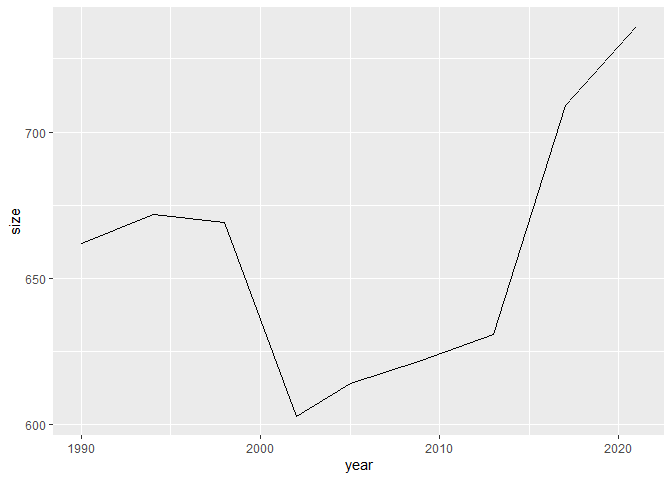
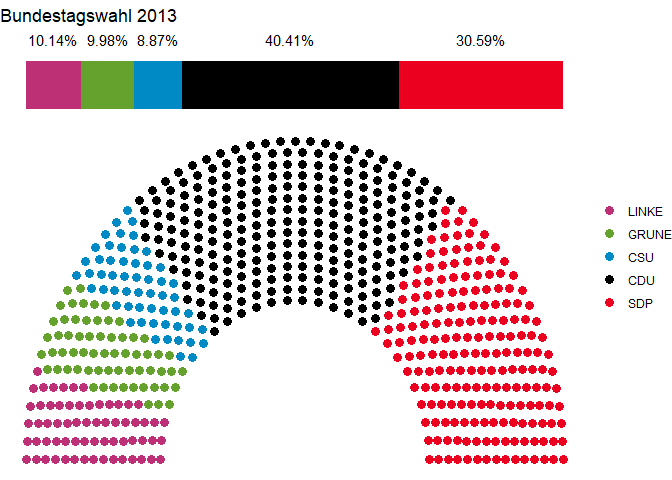

# Outlook of the Course

Todays topics:

- Parliament Plots for Politics
- Machine Learning: Classification with kNN

## Topic Overview

Today We will have small outlooks into further topics which can be
managed in R.

Both topics are completely independent from each other and you can
explore them at your own pace.

## Topic I: Parliament plots

Please install the `ggparliament` package. It is an extension of the
`ggplot2` package and provides all methods for plotting and some example
data.

Now. Load all the important things which are needed:

``` r
library(tidyverse)
library(ggparliament)
```

The package provides a standard dataset with outcomes of many different
elections of the last years. We want to focus on the data of the German
elections. But also please be aware, that these data are not curated.
There is actually an error in the election of 2017.

``` r
german_elections <- tibble(election_data) %>%
  filter(country == "Germany")
head(german_elections)
```

    ## # A tibble: 6 × 8
    ##    year country house     party_long              party_s…¹ seats gover…² colour
    ##   <int> <chr>   <chr>     <chr>                   <chr>     <int>   <int> <chr> 
    ## 1  2005 Germany Bundestag Social Democratic Party SDP         180       0 #EB00…
    ## 2  2017 Germany Bundestag Social Democratic Party SDP         153       0 #EB00…
    ## 3  2009 Germany Bundestag Free Democratic Party   FDP          93       0 #FFED…
    ## 4  1990 Germany Bundestag Free Democratic Party   FDP          79       0 #FFED…
    ## 5  2009 Germany Bundestag The Left                LINKE        76       0 #BE30…
    ## 6  2017 Germany Bundestag The Left                LINKE        69       0 #BE30…
    ## # … with abbreviated variable names ¹​party_short, ²​government

As you can see, the data does not cover data after 2017 and therefore
lacks the newest election. We want to add these data according to
[Bundeswahlleiter.de](https://www.bundeswahlleiter.de/bundestagswahlen/2021/ergebnisse/bund-99.html)
and with respect to the english version of the data:

``` r
tibble(election_data) %>%
  add_row(year=2021, country="Germany", house="Bundestag", party_long="Christian Democratic Union", party_short="CDU", seats=152, government=0, colour = "#000000") %>%
  add_row(year=2021, country="Germany", house="Bundestag", party_long="Social Democratic Party", party_short="SDP", seats=206, government=1, colour = "#EB001F") %>%
  add_row(year=2021, country="Germany", house="Bundestag", party_long="Alternative for Germany", party_short="AFD", seats=83, government=0, colour = "#009EE0") %>%
  add_row(year=2021, country="Germany", house="Bundestag", party_long="Free Democratic Party", party_short="AFD", seats=92, government=1, colour = "#FFED00") %>%
  add_row(year=2021, country="Germany", house="Bundestag", party_long="The Left", party_short="LINKE", seats=39, government=0, colour = "#BE3075") %>%
  add_row(year=2021, country="Germany", house="Bundestag", party_long="Alliance 90/The Greens", party_short="GRUNE", seats=118, government=1, colour = "#64A12D") %>%
  add_row(year=2021, country="Germany", house="Bundestag", party_long="Christian Social Union in Bavaria", party_short="CSU", seats=45, government=0, colour = "#008AC5") %>%
  add_row(year=2021, country="Germany", house="Bundestag", party_long="South Schleswig Voters' Association", party_short="SSW", seats=1, government=0, colour = "#003D90") -> election_data
tibble(election_data) %>%
  filter(country == "Germany") %>%
  filter(house=="Bundestag") -> german_elections
```

Before we look at some parliament plots, we can explore the dataset a
bit more. interesting fact is typically, which years are covered and the
known problem of the parliament size.

``` r
german_elections %>%
  group_by(year) %>%
  summarise(size=sum(seats)) -> parliament_size
parliament_size %>%
  ggplot() +
  aes(x=year, y=size) +
  geom_line()
```

<!-- -->

Now we need to arrange the data for the final parliament plot

``` r
german_elections %>%
  filter(year==2013) -> election_2013
bundestag_2013 <- parliament_data(
  election_data = election_2013,
  type = "semicircle",
  parl_rows = 15,
  party_seats = election_2013$seats)
ggplot(bundestag_2013, aes(x, y, colour=party_short)) +
  geom_parliament_seats(size=3) + 
  geom_parliament_bar(colour = colour, party = party_long) +
  #set theme_ggparliament
  theme_ggparliament() +
  #other aesthetics
  labs(colour = NULL, 
       title = "Bundestagswahl 2013") +
  scale_colour_manual(values = bundestag_2013$colour, 
                      limits = bundestag_2013$party_short)
```

<!-- -->

**Exercise** Create a plot about the Bundestag 2021

## Topic II: Machine learning with k neirest neighbour

K Neirest Neighbour (kNN) is a classification algorithm. This means we
use some knowledge from a dataset to classify new species into their
according classes. In case of the Iris dataset we have 3 species with 4
traits. We will use these 4 traits to classify new species into these
given three classes.

Please remember, that this is a very rough outlook. Your goal is to
reproduce the code, but not to understand the correct algorithm. In
general kNN works like this:

- pick a new species
- look at the traits and place the species into the vector space of all
  training species.
- find out, which class the neirest neighbours are in
- mark the new species as this class

For classification, we will use the iris dataset. First of all we want
to split the dataset into a training and a testing dataset. This can be
realized with the function `sample`. This we save tot he two variables
`trainData` and `testData`

``` r
summary(iris)
```

    ##   Sepal.Length    Sepal.Width     Petal.Length    Petal.Width   
    ##  Min.   :4.300   Min.   :2.000   Min.   :1.000   Min.   :0.100  
    ##  1st Qu.:5.100   1st Qu.:2.800   1st Qu.:1.600   1st Qu.:0.300  
    ##  Median :5.800   Median :3.000   Median :4.350   Median :1.300  
    ##  Mean   :5.843   Mean   :3.057   Mean   :3.758   Mean   :1.199  
    ##  3rd Qu.:6.400   3rd Qu.:3.300   3rd Qu.:5.100   3rd Qu.:1.800  
    ##  Max.   :7.900   Max.   :4.400   Max.   :6.900   Max.   :2.500  
    ##        Species  
    ##  setosa    :50  
    ##  versicolor:50  
    ##  virginica :50  
    ##                 
    ##                 
    ## 

``` r
#Random splitting of iris data as 70% train and 30% test datasets
random <- sample(1:nrow(iris), 0.7 * nrow(iris))
trainData <- iris[random,]
testData <- iris[-random,]
```

The package `class` has a nice implementation for the `kNN` algorithm.

``` r
library(class)
```

First we remove the factorial data and store it in a class vector. This
is a normal approach to split the labels from the data which might be
counter-intuitive.

``` r
trainLabels <- trainData$Species
testLabels <- testData$Species
trainData <- trainData[-5]
testData <- testData[-5]
```

Now we can finally use the implementation to predict the labels of the
test dataset

``` r
testPrediction <- knn(train = trainData, cl = trainLabels, test = testData)
```

Now it’s important to find out the quality of our classification. The
easiest way to do so is to use the confusion matrix:

``` r
confusion <- table(Prediction = testPrediction, Truth = testLabels)
confusion
```

    ##             Truth
    ## Prediction   setosa versicolor virginica
    ##   setosa         14          0         0
    ##   versicolor      0         14         2
    ##   virginica       0          0        15

From here on we can also calculate all the other important metrics to
find out how good our predictions were. We want to concentrate on
virginica flowers here. Many frameworks create classification reports
for multi label approaches. These are averaged values. Sometimes also
weighted averaged values. You should always study the documentation
before you use these metrics.

``` r
TP <- confusion[3,3]
TN <- sum(confusion[1:2,1:2])
FP <- sum(confusion[3,1:2])
FN <- sum(confusion[1:2,3])

accuracy <- (TP+TN)/(TP+TN+FP+FN)
precision <- (TP)/(TP+FP)
recall <- TP/(TP+FN)
specificity <- TN/(FP+TN)
```

- accuracy: 0.956
- precision: 1.000
- recall: 0.882
- specificity: 1.000

KNN is a very fast algorithm because there is no need of a specific
training process. The training set is only used as a ground truth for
the algorithm. One more experiment should be considered.

As default, only the nearest neighbor is considered. But it is also
possible to consider more neighbors to get a better classification. We
want to push it to the limits and use only a very small training set for
classification. Then we want to find out, if using 3 neighbors can
improve this,

``` r
#Random splitting of iris data as 20% train and 80% test datasets
set.seed(4242)
random <- sample(1:nrow(iris), 0.2 * nrow(iris))
trainData <- iris[random,]
testData <- iris[-random,]
trainLabels <- trainData$Species
testLabels <- testData$Species
trainData <- trainData[-5]
testData <- testData[-5]

# knn with k=1 (default)
testPrediction_1 <- knn(train = trainData, cl = trainLabels, test = testData, k=1)
confusion_1 <- table(Prediction = testPrediction_1, Truth = testLabels)
confusion_1
```

    ##             Truth
    ## Prediction   setosa versicolor virginica
    ##   setosa         37          0         0
    ##   versicolor      0         40         5
    ##   virginica       0          2        36

``` r
# knn with k=3
testPrediction_3 <- knn(train = trainData, cl = trainLabels, test = testData, k=3)
confusion_3 <- table(Prediction = testPrediction_3, Truth = testLabels)
confusion_3
```

    ##             Truth
    ## Prediction   setosa versicolor virginica
    ##   setosa         37          0         0
    ##   versicolor      0         41         2
    ##   virginica       0          1        39

But you should consider, that using too many neighbors is dangerous,
when the classes are close to each other as in our case:

``` r
# knn with k=10
testPrediction_10 <- knn(train = trainData, cl = trainLabels, test = testData, k=25)
confusion_10 <- table(Prediction = testPrediction_10, Truth = testLabels)
confusion_10
```

    ##             Truth
    ## Prediction   setosa versicolor virginica
    ##   setosa         37         22         1
    ##   versicolor      0          0         0
    ##   virginica       0         20        40

In case of smaller datasets one of the most influencial parameter is the
split into training and testing set. Using another random seed and split
might completely change our setting:

``` r
set.seed(318008)
# 10% of training
random <- sample(1:nrow(iris), 0.1 * nrow(iris))
trainData <- iris[random,]
testData <- iris[-random,]
trainLabels <- trainData$Species
testLabels <- testData$Species
trainData <- trainData[-5]
testData <- testData[-5]
# knn with k=3
testPrediction_3 <- knn(train = trainData, cl = trainLabels, test = testData, k=3)
confusion_3 <- table(Prediction = testPrediction_3, Truth = testLabels)
confusion_3
```

    ##             Truth
    ## Prediction   setosa versicolor virginica
    ##   setosa         45          0         0
    ##   versicolor      0         43         6
    ##   virginica       0          3        38
